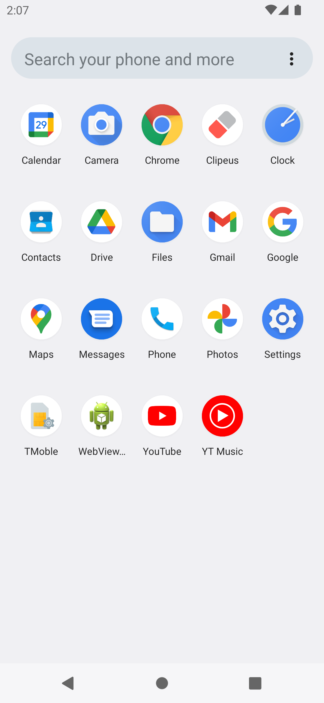

# Clipeus

Clipboard cleaner.

Tiny app to clean clipboard.

No UI. Click on the app icon to clean clipboard. 
Also you can grant device & app notifications permission to clean clipboard automatically on 
screen off (long tap on the app icon).

## Permissions

* NOTIFICATION_LISTENER - receive screen off events (optional)

## Related

* [ClipboardCleaner](https://github.com/DeweyReed/ClipboardCleaner)
* [ClipeusX](https://github.com/x13a/ClipeusX)
* [MemoryGuardian](https://github.com/hashemi-hossein/memory-guardian)

## License

